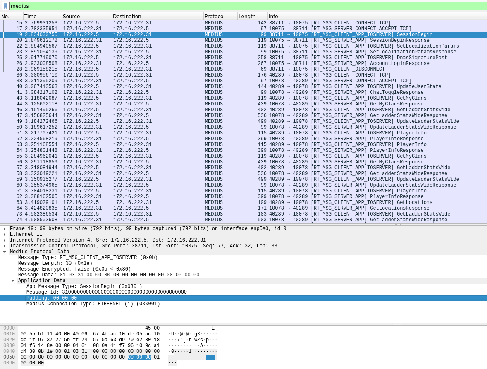

# Medius Wireshark Dissector

An Open Source Medius packet dissector for Wireshark.

Reference: https://wiki.hashsploit.net/PlayStation_2#Medius

Verified working on:

- **Linux** Wireshark Version 3.2.3 (Git v3.2.3 packaged as 3.2.3-1)
- **Mac OS X** Wireshark Version 3.4.9 (v3.4.9-0-g365e236f5efe)
- **Windows 7** Version 3.4.10 (v3.4.10-0-g733b3a137c2b)

### Installation

Installation instructions

#### Mac & Linux
1. Run `./install.sh` (or manually copy `medius_wireshark_dissector.lua` to `~/.local/lib/wireshark/plugins`. If the directory does not exist, create it.).
2. Open Wireshark directly or open a .pcapng/.pcap file.
3. Read & accept the agreement.

Path `~/.local/lib/wireshark/plugins`

#### Windows

Path `C:\Users\%USERNAME%\AppData\Roaming\Wireshark\plugins\`

1. Copy `medius_wireshark_dissector.lua` to `%APPDATA%\Wireshark\plugins`. If the directory does not exist, create it.
2. Open Wireshark directly or open a .pcapng/.pcap file.
3. Read & accept the agreement.

