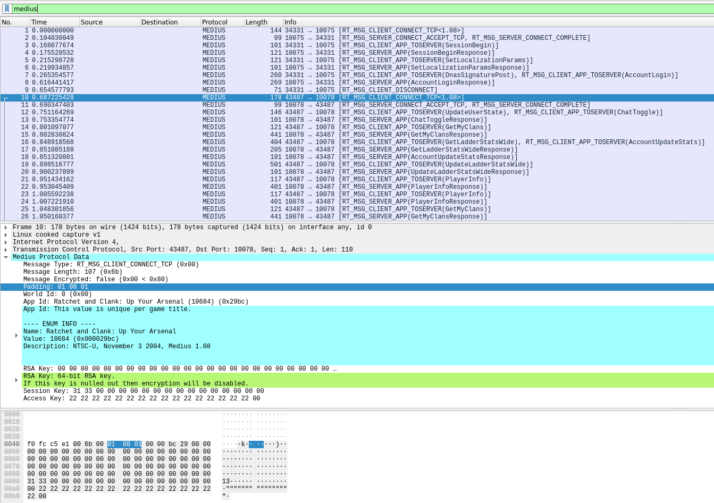

# Medius Wireshark Dissector

An Open Source Medius packet dissector for Wireshark.

Reference: https://wiki.hashsploit.net/PlayStation_2#Medius

### Installation

For Linux: Copy `medius_wireshark_dissector.lua` to `~/.local/lib/wireshark/plugins`.
If the directory does not exist, create it.

